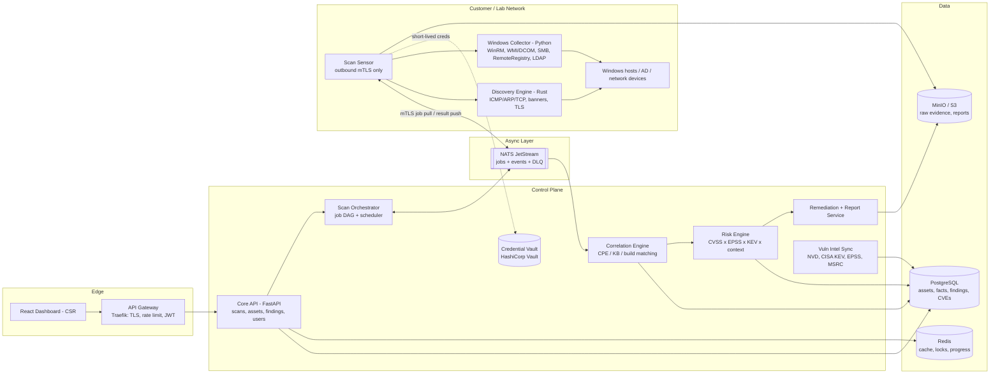
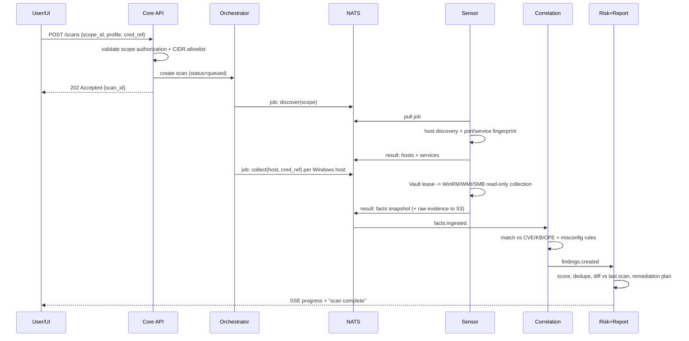

# Warden — System Architecture

> Agentless Vulnerability & Network Scanner. Built on a standard layered shape: edge → gateway → stateless services → data → async, with sync vs async decided per side-effect; per-route rendering and server state kept separate from client state on the frontend; GitOps with rollback as `git revert` and observability from the first deploy.

## 1. Design principles

1. **Agentless on targets, not "no software anywhere."** Nothing is installed on scanned Windows machines. A lightweight **Scan Sensor** container runs inside the target network and connects **outbound-only** (mTLS) to the control plane — no inbound firewall holes. (Same model as Tenable Nessus / Qualys scanner appliances.)
2. **Separate collection from judgment.** Sensors only collect *facts* (ports, OS build, installed KBs, registry values, services). All vulnerability logic runs centrally, so a new CVE can be re-evaluated against stored facts without re-scanning.
3. **Safe-by-default.** Read-only / fingerprinting checks, never exploitation. Every scan requires an authorized scope (CIDR allowlist + owner sign-off record) and is rate-limited.
4. **Sync vs async per side-effect.** Creating a scan is sync; discovery, collection, correlation, scoring, reporting are all queued jobs.

## 2. High-level architecture



## 3. Components

| Layer | Component | Tech | Responsibility |
|---|---|---|---|
| Edge | Dashboard | React + TS, Vite, TanStack Query (server state), Zustand (UI state) | CSR (auth-gated); public docs can be SSG |
| Entry | API Gateway | Traefik (or Caddy) | TLS, JWT verify, rate limits, request size limits |
| Service | **Core API** | FastAPI, SQLAlchemy 2, Pydantic | CRUD for scopes/scans/assets/findings, RBAC, audit log |
| Service | **Scan Orchestrator** | Python worker | Scan → job DAG (§4), scheduling, retries, per-subnet concurrency caps, cancellation |
| Sensor | **Discovery Engine** | Rust (tokio; raw sockets via `pnet` later) | Host discovery, async connect/SYN scan, banner grab, TLS cert/cipher, SMB negotiate (SMBv1? signing required?), RDP NLA check |
| Sensor | **Windows Collector** | Python (`impacket`, `pywinrm`, `ldap3`) | Credentialed, read-only collection (§5) |
| Intel | **Vuln Intel Sync** | Python cron jobs | NVD CVE API 2.0, CISA KEV, FIRST EPSS, **Microsoft MSRC CVRF API** (KB → CVE mapping) → normalized in Postgres |
| Logic | **Correlation Engine** | Python (Rust later if needed) | Facts → CVEs: OS build+UBR vs MSRC fixed builds, software CPE vs NVD configs, missing KBs, misconfig rules (YAML check DSL) |
| Logic | **Risk Engine** | Python | Priority = f(CVSS, EPSS, KEV, exposure, asset criticality, auth required) → P1–P4 |
| Logic | **Remediation + Reports** | Python, Jinja2 → HTML/PDF, CSV, SARIF, JSON | Per-finding fix steps (KB, registry/GPO, disable service), "one patch fixes N CVEs" grouping, scan-to-scan diff |
| Cross-cutting | Secrets | HashiCorp Vault | Scan creds encrypted + leased; sensor gets short-lived creds per job; never in Postgres or logs |
| Cross-cutting | Observability | OpenTelemetry → Prometheus, Loki, Tempo, Grafana | Trace a scan API → orchestrator → sensor → correlation |

**Why NATS JetStream over Celery:** polyglot workers (Rust + Python), sensors pulling jobs over one outbound connection, durable streams + acks + DLQ built in.

## 4. Scan lifecycle



Stages: **discover → fingerprint → authenticated collect → normalize → correlate → score → remediate/report.** Each stage is idempotent, keyed by `(scan_id, host_id, stage)`.

## 5. Windows collection (agentless)

| Protocol | Port | Collects |
|---|---|---|
| SMB2/3 negotiate (unauth) | 445 | Dialects (SMBv1?), signing required, OS hint |
| WinRM / PowerShell remoting | 5985/5986 | Preferred: OS build + UBR, hotfixes, installed software, services, local admins, firewall profiles, Defender, BitLocker, audit policy |
| WMI over DCOM | 135 + dynamic | Fallback: `Win32_OperatingSystem`, `Win32_QuickFixEngineering`, `Win32_Service` |
| Remote Registry (MS-RRP) via SMB | 445 | Uninstall keys, SChannel TLS, LLMNR/NetBIOS, NTLM level, LSA protection, RDP NLA |
| LDAP to AD | 389/636 | Computer inventory, OS attrs, stale machines, password policy, unconstrained delegation |
| TLS / RDP / HTTP probes | various | Cert expiry, weak ciphers, exposed mgmt interfaces |

Finding families: **Vulnerabilities** (CVE via build/KB/software version) and **Misconfigurations** (CIS-style rules: SMBv1, SMB signing off, LLMNR on, NTLMv1, RDP without NLA, weak password policy).

## 6. Core data model

```
tenants ─┬─ scopes (cidrs, authorization_doc, owner, expires_at)
         ├─ credentials_ref (vault_path only)
         ├─ sensors (id, cert_fingerprint, last_seen, version)
         ├─ scans (scope_id, profile, status, started/finished)
         │    └─ scan_jobs (stage, host, attempts, status)
         ├─ assets (hostname, ips[], os, build, ubr, criticality, first/last_seen)
         │    ├─ services (port, proto, product, version, cpe, banner)
         │    └─ fact_snapshots (scan_id, jsonb facts, evidence_uri)
         └─ findings (asset_id, type[cve|misconfig], ref_id, status[open|fixed|accepted],
                      cvss, epss, kev, priority, first_seen, last_seen, evidence)
intel: cves, cve_cpe_matches, msrc_kb_map(kb → cves, fixed_build), kev, epss_scores, check_rules
```

Findings have a lifecycle (open → fixed → reopened) so trends fall out of the data.

## 7. Frontend

- Routes: Overview, Assets, Asset detail, Findings, Remediation plan, Scans (live SSE), Scopes & authorization, Sensors, Reports, Settings.
- Rendering: CSR app; optional SSG docs site.
- State: TanStack Query for API data; Zustand for filters/layout/drawers — never mixed.
- Visuals: topology graph (Cytoscape.js / react-flow), subnet heatmap, risk trend.

## 8. DevOps

- Local: `docker compose` — Postgres, Redis, NATS, MinIO, Vault (dev), API, workers, sensor, UI.
- CI (GitHub Actions): ruff, mypy, pytest, cargo clippy/test, ESLint, vitest, semgrep, Trivy, gitleaks → multi-arch images to GHCR.
- CD: CI bumps tag in `deploy/` → Argo CD reconciles k3s → Kyverno policies (block privileged pods except sensor with NET_RAW). Rollback = git revert.
- Lab: small AD lab (Windows Server DC + misconfigured clients) as ground truth for detection accuracy.

## 9. Build phases

1. **M1 Discovery** — Rust scanner, service fingerprint, asset inventory, basic UI.
2. **M2 Windows collection** — WinRM/WMI/registry collectors, Vault integration, fact snapshots.
3. **M3 Intel + correlation** — NVD/MSRC/KEV/EPSS sync, KB/build matching, misconfig rule DSL.
4. **M4 Risk + remediation** — scoring, patch grouping, reports, scan diffs.
5. **M5 Production-grade** — remote sensors with mTLS, scheduling, multi-tenancy, OTel dashboards, GitOps deploy.
6. **Stretch** — attack-path graph; LLM remediation summaries grounded only in stored findings.

## 10. Folder structure

```
warden/
├── CLAUDE.md
├── docs/{architecture.md, ROADMAP.md, adr/, checks/, safety-and-scope.md}
├── apps/{web/, docs-site/}
├── services/{api/, orchestrator/, intel-sync/, correlation/, risk/, reporting/}
├── sensor/{agent-runtime/, discovery/ (Rust), collectors/windows/}
├── checks/{windows/, network/}          # misconfig rules as YAML data
├── packages/{schemas/, py-common/}      # shared contracts + utilities
├── deploy/{docker-compose.yml, docker/, k8s/, argocd/, policies/, observability/}
├── lab/{terraform|vagrant/, misconfig-scripts/}
├── scripts/
└── .github/workflows/
```
